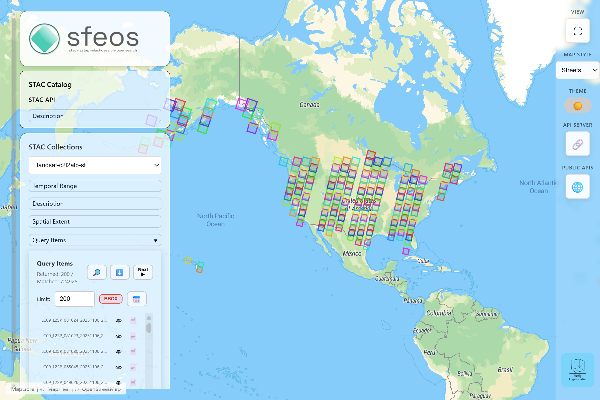

# sfeos-web
Front-facing web interface for [SFEOS](https://github.com/stac-utils/stac-fastapi-elasticsearch-opensearch) - stac-fastapi-elasticsearch-opensearch   

https://healy-hypersaptial.github.io/sfeos-web

## Configuration

You can override the default STAC API URL by appending the `stacApiUrl` parameter to the application URL:

```
https://healy-hypersaptial.github.io/sfeos-web?stacApiUrl=http://localhost:8080
```

**Note:** The parameter name `stacApiUrl` is case-sensitive.


